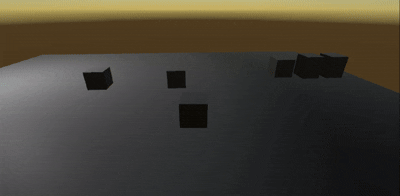

# Unity C# 日志 - 2025-10-16

## 今日目标

* [√] 目标1：为昨天的小方块编写摄像头跟随移动脚本，利用Lerp实现了摄像头有“滞后感”的跟随，实现了使用鼠标操控摄像头沿着x\y轴旋转
* [√] 目标2：鼓励并肯定自己
* [ ] 目标3：

## 今日完成

* 内容总结：Lerp真是一个很神奇的方法，如同阿基里斯和乌龟一样让摄像头永远无法到达和物块完全贴合的位置
* Demo截图/视频链接：
* 笔记/心得：又是微分，还好我是学计算机的，不是我喜欢的浮点数，我直接丢失

## 遇到的问题

* 问题1：实现滞后感的跟随与让鼠标操控摄像机沿着x轴旋转有冲突，因为前者的实现方式是计算摄像头的下一个位置，让摄像头移动过去，也就是和小物块是一定会有一个相对坐标的关系，让摄像头围绕y轴旋转是修改了小物块的朝向，所有摄像头紧跟着改变朝向，而绕x轴旋转的话就要舍弃滞后感的移动
* 问题2：
* 解决方案/待解决事项：不知道，明天看
